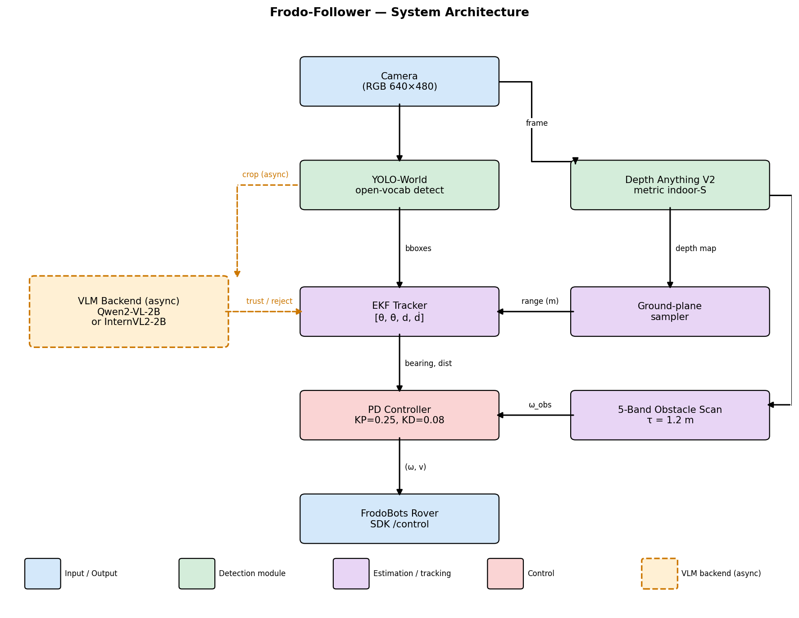

# Frodo-AI — Autonomous Object Navigation for FrodoBots


Autonomous navigation system for the [FrodoBots Earth Rover](https://frodobots.com/) platform. Tell the robot where to go in plain English — it detects the target with YOLO, estimates depth with Depth Anything V2, plans collision-free trajectories with MPPI, and drives there using visual servoing. Both models are exported to TensorRT FP16 engines for real-time inference on VRAM. No maps, no LiDAR, no LLM — just vision.

Built for the [FrodoBots Earth Rover Challenge](https://www.frodobots.com/erc).

## Demo

<p align="center"><b>"Go to the chair"</b> — natural language object navigation</p>

<p align="center">

https://github.com/user-attachments/assets/bd51aed4-1628-48da-b842-15a2e5776b1b

</p>

<p align="center"><b>"Go to the person"</b> — human target tracking</p>

<p align="center">

https://github.com/user-attachments/assets/8ffeb659-7b90-401f-a34a-0e56bf7467e0

</p>

<p align="center"><b>Obstacle avoidance</b> — depth-based collision prevention</p>

<p align="center">

https://github.com/user-attachments/assets/c3eca453-9161-42fc-9d32-ce3f971de85a

</p>

<p align="center"><b>"Go to the person" + obstacle avoidance</b> — combined navigation</p>

<p align="center">

https://github.com/user-attachments/assets/b140a3c0-7449-421b-a70d-6e6f2073b25b

</p>


## System Architecture

<p align="center">
  
</p>

## How It Works

**Perception — What's out there?**
1. YOLO 11m runs object detection at ~8 ms per frame via TensorRT FP16, detecting 80+ COCO classes
2. Natural language commands are parsed into YOLO class names via fuzzy matching and alias resolution — no LLM required
3. Depth Anything V2 (Small) produces metric monocular depth maps at ~30 ms via TensorRT FP16, giving distance to every pixel in the scene

**Planning — Where to go?**
1. MPPI (Model Predictive Path Integral) samples 512 candidate trajectories over a 12-step horizon
2. Each trajectory is scored against a depth-derived obstacle cost map, goal heading reward, and smoothness penalty
3. Soft-minimum weighting selects the optimal control command in ~6 ms on CPU

**Control — How to get there?**
1. Visual servoing keeps the target object centered in the camera frame using proportional steering
2. Approach speed scales with target distance — full speed at range, creeping near arrival
3. If the target is lost, the controller maintains last-known heading for 15 frames before entering search mode
4. For outdoor GPS missions, a proportional heading controller steers toward sequential checkpoints with depth-based obstacle override

**Interface — Putting it together**
1. Web UI at `localhost:5000` streams live YOLO detections, depth maps, and MPPI trajectory visualizations
2. Type commands like "go to the chair" or click detected objects to set navigation targets
3. FrodoBot SDK communication handles camera frames, sensor data, and motor commands over HTTP

## Pipeline Latency

Benchmarked on ASUS ROG Strix with RTX 4080 (12 GB VRAM), TensorRT FP16 engines.

| Component | Latency | Device |
|-----------|---------|--------|
| YOLO 11m detection (TensorRT FP16) | ~8 ms | GPU |
| Depth Anything V2 Small (TensorRT FP16) | ~30 ms | GPU |
| MPPI planning (512 samples) | ~6 ms | CPU |
| Visual servo + control | <1 ms | CPU |
| **Total pipeline** | **~45 ms** | **Mixed** |

## Project Structure

```
frodo_ai/
├── perception/
│   ├── object_detector.py       # YOLO detection + NLP target matching
│   ├── depth_estimator.py       # Depth Anything V2 wrapper (metric depth)
│   └── depth_safety.py          # Runtime depth safety layer for waypoint override
├── planning/
│   ├── mppi_planner.py          # MPPI trajectory optimization (512 samples, 12-step horizon)
│   └── gps_navigator.py         # Haversine GPS math + waypoint manager
├── control/
│   ├── visual_servo.py          # Proportional visual servoing controller
│   └── outdoor_controller.py    # GPS heading P-controller with depth obstacle avoidance
└── interface/
    └── rover_interface.py       # FrodoBot SDK HTTP communication

scripts/
├── web_navigator.py             # Web UI — type objects, robot navigates to them
├── outdoor_nav.py               # GPS waypoint navigation for ERC outdoor missions
├── depth_viewer.py              # Live DA2 depth + obstacle avoidance viewer
├── mapper_3d.py                 # MPPI driving + 3D point cloud mapping
└── ros2_node.py                 # ROS2 publisher (PointCloud2, Image, Odometry, Path)
```

## Quick Start

### 1. Install

```bash
git clone https://github.com/tarunkumarnyu/frodo-ai.git
cd frodo-ai
python3 -m venv venv && source venv/bin/activate
pip install -r requirements.txt
```

### 2. Download Depth Anything V2 checkpoint

```bash
mkdir -p third_party/Depth-Anything-V2/checkpoints
# Download from: https://huggingface.co/depth-anything/Depth-Anything-V2-Metric-Indoor-Small
# Place depth_anything_v2_metric_hypersim_vits.pth in the checkpoints directory
```

### 3. Configure

```bash
cp config/.env.example config/.env
# Edit config/.env with your SDK_API_TOKEN and BOT_SLUG
```

### 4. Start the SDK server

```bash
cd earth-rovers-sdk && hypercorn main:app --reload
```

### 5. Run

```bash
# Web navigator (indoor object navigation)
python scripts/web_navigator.py
# Open http://localhost:5000

# GPS outdoor navigation (ERC missions)
python scripts/outdoor_nav.py --send-control --depth-safety

# Depth viewer
python scripts/depth_viewer.py

# 3D mapper
python scripts/mapper_3d.py
```

## Design Decisions

- **No LLM for command parsing** — Fuzzy string matching against YOLO's 80 classes with alias expansion handles natural language commands at zero latency and zero cost, covering the practical command space without API dependencies
- **MPPI over deterministic planners** — Sampling-based trajectory optimization naturally handles the noisy, non-convex cost landscapes from monocular depth, while deterministic planners (A*, DWA) require clean grid maps that monocular depth cannot provide
- **Visual servoing as primary control** — Centering the target in the camera frame provides a simple, robust control law that degrades gracefully when depth estimates are noisy, with MPPI providing the obstacle avoidance layer underneath
- **Monocular depth over LiDAR** — The FrodoBot platform has only a single front camera; Depth Anything V2 extracts usable obstacle clearance from this constraint, eliminating the need for additional sensors
- **Polar clearance representation** — Converting the full depth map into a 1D angular clearance vector reduces the obstacle avoidance problem to a lightweight lookup, enabling real-time safety checks without expensive 3D reasoning

## Hardware

| Component | Spec | Purpose |
|-----------|------|---------|
| Robot | FrodoBots Earth Rover (Mini/Zero) | Mobile platform |
| Camera | Wide-angle front camera (90° FOV) | Visual perception |
| Sensors | GPS, IMU (accel/gyro/mag), wheel RPM | Outdoor navigation + odometry |
| Compute | ASUS ROG Strix — RTX 4080 (12 GB VRAM) | TensorRT inference for YOLO + DA2 |

## Scripts

| Script | Description |
|--------|-------------|
| `web_navigator.py` | Web UI — type natural language commands, robot navigates to detected objects |
| `outdoor_nav.py` | GPS waypoint navigation with optional depth obstacle avoidance for ERC missions |
| `depth_viewer.py` | Live depth visualization with polar clearance overlay |
| `mapper_3d.py` | MPPI-driven exploration with 3D point cloud mapping |
| `ros2_node.py` | ROS2 node publishing PointCloud2, Image, Odometry, and Path topics |

## Configuration

All parameters are tunable in `config/default.yaml`:

| Parameter | Default | Description |
|-----------|---------|-------------|
| `perception.yolo_model` | `yolo11m.pt` | YOLO model variant |
| `perception.depth_model` | `small` | DA2 model size (small/base/large) |
| `planning.mppi_samples` | `512` | Number of MPPI trajectory samples |
| `planning.mppi_horizon` | `12` | Planning horizon (timesteps) |
| `control.max_linear` | `0.30` | Maximum forward speed |
| `control.arrival_distance` | `0.8` | Stop distance from target (meters) |

## Stack

`Python` · `PyTorch` · `TensorRT FP16` · `YOLO 11m` · `Depth Anything V2` · `MPPI` · `OpenCV` · `ROS 2 Jazzy` · `FrodoBot SDK` · `ASUS ROG Strix RTX 4080`

## License

MIT
