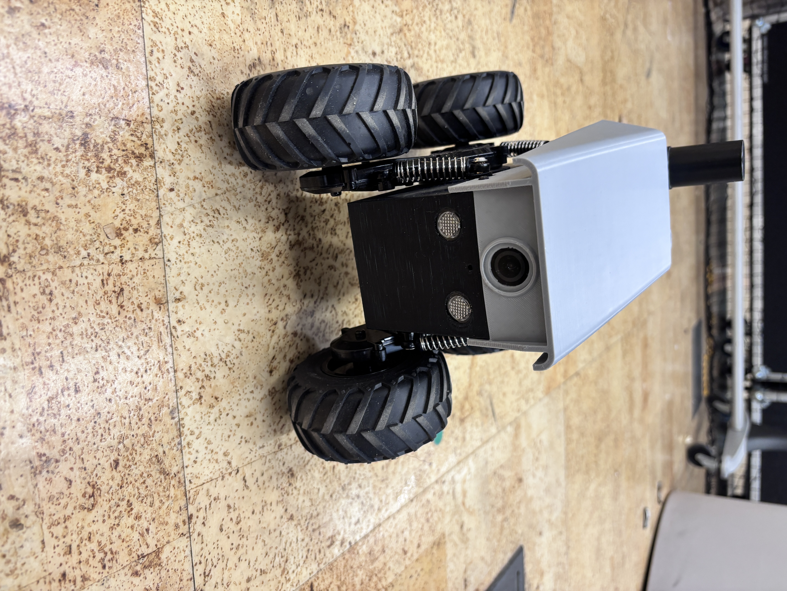
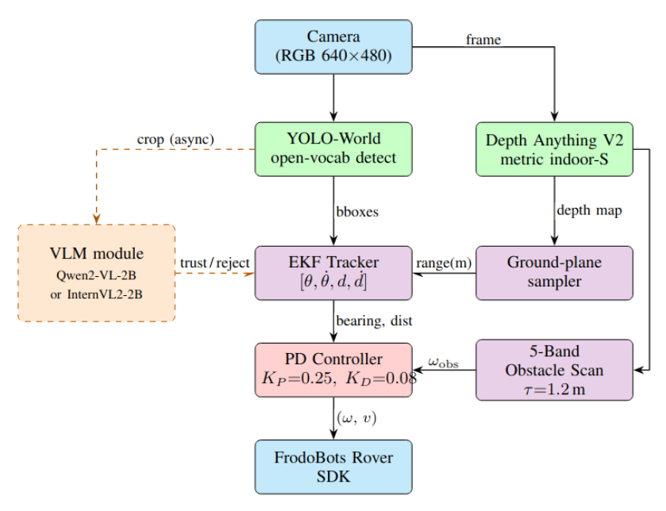

# frodo-follower

Two autonomous navigation modes for the [FrodoBots Earth Rover](https://frodobots.com/): navigate to a named object in plain English, or lock onto a person and follow them. No maps, no GPS.

## Demo

[▶ Watch demo video](assets/demos/IMG_9387.MOV)



## Modes

### Smart Navigator

Type a query into the web UI. The robot finds the target and drives to it.

Supported query formats:

| Query | What it does |
|---|---|
| `chair` | Find any chair |
| `person with red shirt` | VLM verifies the description before locking on |
| `tv on your left` | Only considers detections on the left side of the frame |
| `monitor on the right` | Only considers detections on the right |
| `person on the chair` | VLM confirms the spatial relationship |

Run:
```bash
python3 scripts/smart_navigator.py
# Open http://localhost:5002
```

To use InternVL2-2B instead of Qwen2-VL-2B:
```bash
python3 scripts/smart_navigator.py --vlm-model internvl
```

### Person Follower

Click a person in the camera feed to lock on. The robot follows them and stops at 2.5 m so the full person stays in frame. If the person is lost at close range, the robot backs up briefly and tries to re-acquire before giving up.

Run:
```bash
python3 scripts/person_follower.py
# Open http://localhost:5001
```

To use InternVL2-2B:
```bash
python3 scripts/person_follower.py --vlm-model internvl
```

## Architecture



Solid arrows are per-frame data paths (~10 Hz). Dashed orange arrows are low-frequency asynchronous VLM paths (~0.3 Hz).

## How it works

On the RTX 5070 Ti test setup, YOLO-World plus Depth Anything V2 plus the tracker and controller together typically run **about 8–12 FPS** (the VLM runs asynchronously and does not affect throughput).

**Detection** — YOLO-World (`yolov8s-worldv2.pt`) handles open-vocabulary detection. For descriptive queries like "person with brown shirt", the noun is extracted for YOLO and the full description is passed to the VLM for verification.

**Depth** — Depth Anything V2 (metric, indoor) runs every frame producing per-pixel depth in metres. Distance to the target is sampled from the lower 25% of the bounding box (feet/legs region) which gives ground-plane distance rather than line-of-sight to the torso.

**Tracking** — An EKF with state `[angle, angular_velocity, distance, approach_velocity]` maintains a smooth estimate across frames. Appearance-based re-ID (HSV histogram) handles occlusions and re-acquisition.

**VLM** — A vision-language model runs in a background thread at ~0.3 Hz. It verifies YOLO detections against descriptive queries, guides the search rotation when the target is lost, and advises LEFT/RIGHT when the robot is stuck behind an obstacle. Two backends are supported:

| Model | Flag | VRAM |
|---|---|---|
| Qwen2-VL-2B *(default)* | `--vlm-model qwen` | ~3.8 GB |
| InternVL2-2B | `--vlm-model internvl` | ~4.4 GB |

**Control** — PD controller on bearing error (`KP=0.25, KD=0.08`) with derivative clamping. Obstacle avoidance uses a 5-band depth scan across the forward view; the widest gap determines the bypass arc direction. Emergency backup triggers below 0.6 m — the robot turns toward the wider gap while reversing, then arcs around the obstacle at 0.45 rad/s for 3.5 s.

## File layout

```
scripts/
    smart_navigator.py      navigation to named objects, Flask UI on :5002
    person_follower.py      click-to-follow person, Flask UI on :5001

frodo_ai/perception/
    target_tracker.py       EKF tracker + appearance re-ID
    depth_estimator.py      Depth Anything V2 wrapper (metric depth, metres)
    vlm_backend.py          VLM inference backends (Qwen2-VL-2B, InternVL2-2B)

web/
    smart_nav.html          UI for smart navigator
    follower.html           UI for person follower

assets/
    system.png              System architecture diagram
    demos/                  Demo videos and photos
```

## Setup

**1. Clone**

```bash
git clone https://github.com/jotheesh1729/frodo-follower.git
cd frodo-follower
```

**2. Install dependencies**

```bash
pip install torch torchvision
pip install "transformers==4.46.3" qwen-vl-utils timm sentencepiece
pip install ultralytics flask opencv-python pillow requests numpy
```

**3. Download model weights**

YOLO-World — put in repo root:
```bash
wget https://github.com/ultralytics/assets/releases/download/v8.3.0/yolov8s-worldv2.pt
```

Depth Anything V2 (metric indoor, small):
```bash
mkdir -p third_party/Depth-Anything-V2/checkpoints
python3 -c "
from huggingface_hub import hf_hub_download
hf_hub_download(
    repo_id='depth-anything/Depth-Anything-V2-Metric-Hypersim-Small',
    filename='depth_anything_v2_metric_hypersim_vits.pth',
    local_dir='third_party/Depth-Anything-V2/checkpoints'
)
"
```

Qwen2-VL-2B — downloads automatically on first run via Hugging Face.

InternVL2-2B (optional, for `--vlm-model internvl`) — pre-download before first run (4.4 GB):
```bash
huggingface-cli download OpenGVLab/InternVL2-2B
```

**4. Start the Earth Rovers SDK**

The `earth-rovers-sdk/` bridge mirrors the front camera over HTTP (`GET /v2/front`) and accepts drive commands (`POST /control-legacy` with `linear`/`angular` in −1…1). Both scripts default to `http://localhost:8000`.

```bash
cd earth-rovers-sdk && hypercorn main:app --reload
```

**5. Run**

```bash
python3 scripts/smart_navigator.py    # object navigation
# or
python3 scripts/person_follower.py    # person following
```

## Hardware

Tested on FrodoBots Earth Rover (Mini) with an RTX 5070 Ti (12 GB VRAM). A GPU with at least 6 GB VRAM is needed to run the VLM. YOLO-World and Depth Anything V2 fall back to CPU if no GPU is available, but frame rate will drop significantly.

## Credits

Based on [frodo-ai](https://github.com/tarunkumarnyu/frodo-ai) by [Tarun Kumar](https://github.com/tarunkumarnyu).

## License

MIT
